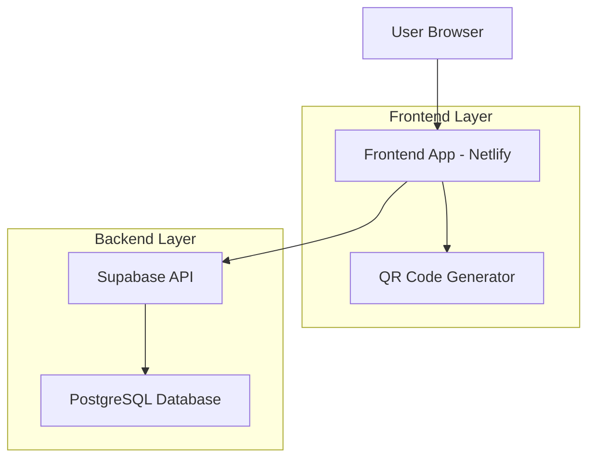
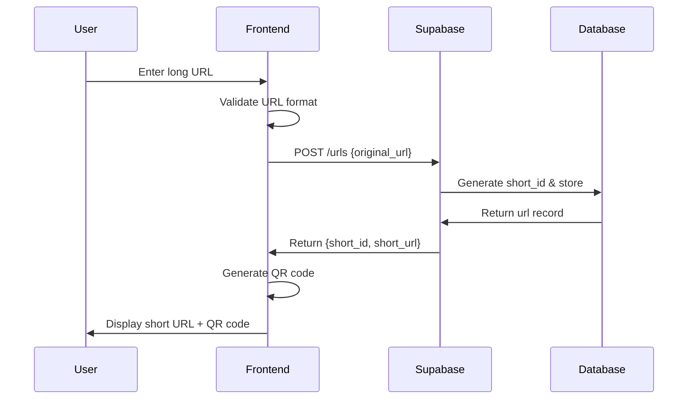
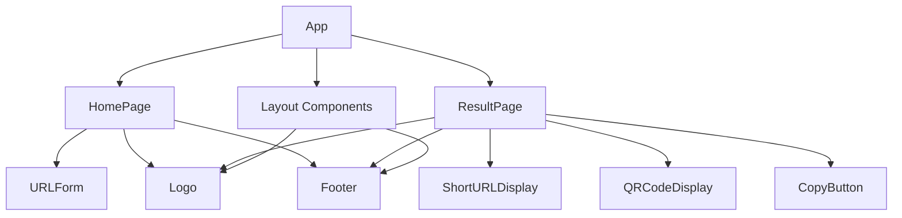
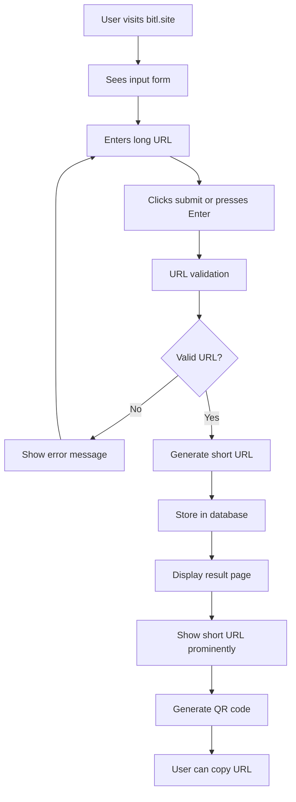

# Simple URL Shortener Service - bitl.site

## Overview

A minimalist URL shortening service that transforms long URLs into short, shareable links with accompanying QR codes. The service prioritizes simplicity and speed, featuring a clean monochromatic design with Inter typography and full mobile responsiveness.

### Core Value Proposition
- Instant URL shortening without registration
- Clean, distraction-free user interface
- Mobile-first responsive design
- QR code generation for easy sharing
- Fast loading and minimal friction

### Key Design Principles
- Minimalist aesthetic with monochromatic color palette
- Inter font family for clean typography
- Mobile-first responsive approach
- Single-purpose focused functionality
- Zero registration barriers

## Technology Stack & Dependencies

### Frontend Stack
- **Framework**: React (for component-based UI)
- **Styling**: Tailwind CSS (for rapid, consistent styling)
- **Typography**: Inter font family
- **Deployment**: Netlify (static site hosting)
- **QR Generation**: Client-side QR code library
- **State Management**: React hooks (useState, useEffect)

### Backend Stack
- **Platform**: Supabase (Backend-as-a-Service)
- **Database**: PostgreSQL (via Supabase)
- **API**: Supabase REST API
- **Authentication**: None required for current version

### Design System
- **Color Palette**: Monochromatic (grayscale with single accent)
- **Typography Scale**: Inter font, single scale (x1)
- **Spacing**: Consistent spacing units
- **Components**: Minimal, purpose-driven components

## Architecture

### System Architecture



### Data Flow Architecture



## Frontend Architecture

### Component Hierarchy



### Component Specifications

| Component | Purpose | Props | State |
|-----------|---------|-------|-------|
| **App** | Root component, routing | None | currentPage, urlData |
| **HomePage** | Landing page layout | None | None |
| **URLForm** | URL input and submission | onSubmit | inputValue, isLoading |
| **ResultPage** | Display shortened URL results | urlData | None |
| **ShortURLDisplay** | Show shortened URL prominently | shortUrl, originalUrl | None |
| **QRCodeDisplay** | Generate and show QR code | shortUrl | None |
| **CopyButton** | Copy URL to clipboard | textToCopy | copied |
| **Logo** | Brand logo display | None | None |
| **Footer** | Copyright information | None | None |

### Routing & Navigation

| Route | Component | Purpose |
|-------|-----------|---------|
| `/` | HomePage | URL input form |
| `/result` | ResultPage | Display shortened URL and QR |

### State Management Strategy

Using React's built-in state management:
- **Component State**: Form inputs, loading states, copy feedback
- **URL Parameters**: Share result page state via URL
- **Local Storage**: None required for current version

### Styling Strategy

**Approach**: Utility-first CSS with Tailwind
- **Breakpoints**: Mobile-first responsive design
- **Color System**: Monochromatic palette (blacks, whites, grays)
- **Typography**: Inter font family with consistent sizing
- **Layout**: Flexbox and Grid for responsive layouts

### API Integration Layer

**Supabase Client Configuration**:
- REST API calls for URL creation
- Error handling for invalid URLs
- Rate limiting consideration
- Response data transformation

## Backend Architecture

### API Endpoints Reference

| Endpoint | Method | Purpose | Request Schema | Response Schema |
|----------|--------|---------|----------------|-----------------|
| `/urls` | POST | Create shortened URL | `{original_url: string}` | `{id, short_id, original_url, short_url, created_at}` |
| `/s/{short_id}` | GET | Redirect to original URL | Path parameter | 302 Redirect |

### Request/Response Schemas

**Create URL Request**:
```
{
  original_url: string (required, valid URL format)
}
```

**Create URL Response**:
```
{
  id: uuid,
  short_id: string,
  original_url: string,
  short_url: string,
  created_at: timestamp
}
```

### Data Models & Database Schema

**URLs Table**:
| Column | Type | Constraints | Purpose |
|--------|------|-------------|---------|
| id | UUID | Primary Key | Unique identifier |
| short_id | VARCHAR(8) | Unique, Not Null | Short URL identifier |
| original_url | TEXT | Not Null | Original long URL |
| created_at | TIMESTAMP | Default NOW() | Creation timestamp |

### Business Logic Layer

**URL Shortening Algorithm**:
- Generate random alphanumeric string (6-8 characters)
- Check uniqueness against existing short_ids
- Retry generation if collision occurs
- Store mapping in database

**URL Validation**:
- Verify valid URL format using regex
- Check for protocol (http/https)
- Validate domain structure
- Reject malicious or inappropriate URLs

**Redirect Logic**:
- Look up short_id in database
- Return 404 if not found
- Return 302 redirect to original_url
- No analytics tracking in current version

## User Experience Flow

### Primary User Journey



### Page Layouts

**Home Page Layout**:
- Header: Logo centered
- Main: Large input field with submit button
- Footer: Copyright text

**Result Page Layout**:
- Header: Logo (smaller, top-left)
- Main: Large short URL display with copy button
- Secondary: QR code display
- Footer: Copyright text

## Testing Strategy

### Frontend Testing
- **Unit Tests**: Component behavior validation
- **Integration Tests**: API communication flow
- **E2E Tests**: Complete user journey testing
- **Responsive Tests**: Mobile device compatibility

### Backend Testing
- **API Tests**: Endpoint functionality validation
- **Database Tests**: Data integrity verification
- **Load Tests**: Performance under traffic
- **Security Tests**: Input validation and injection prevention

## Performance Considerations

### Frontend Optimization
- Lazy loading for QR code generation
- Minimal JavaScript bundle size
- Optimized image assets
- CDN delivery via Netlify

### Backend Optimization
- Database indexing on short_id column
- Connection pooling via Supabase
- Caching strategy for popular URLs
- Rate limiting to prevent abuse

## Security & Privacy

### Input Validation
- URL format validation
- XSS prevention in URL display
- CSRF protection for form submissions
- Rate limiting per IP address

### Data Privacy
- No user tracking or analytics
- Minimal data collection
- No personal information storage
- URLs stored without user association

## Mobile Responsiveness

### Breakpoint Strategy
- **Mobile**: 320px - 768px (primary target)
- **Tablet**: 768px - 1024px
- **Desktop**: 1024px+ (secondary target)

### Mobile-First Features
- Touch-friendly button sizes
- Readable typography on small screens
- Optimized QR code sizing
- Simplified navigation patterns

## Error Handling

### User-Facing Errors
- Invalid URL format feedback
- Network connection issues
- Service unavailability messages
- Copy action feedback

### System Error Responses
- 400: Bad Request (invalid URL)
- 404: Short URL not found
- 429: Rate limit exceeded
- 500: Internal server error

## Deployment Strategy

### Frontend Deployment (Netlify)
- Static site generation
- Automatic builds from git repository
- Custom domain configuration (bitl.site)
- HTTPS enforcement

### Backend Deployment (Supabase)
- Managed PostgreSQL database
- Auto-scaling API endpoints
- Built-in security features
- Real-time capabilities (not used initially)


